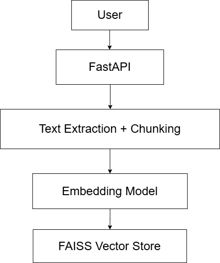

📌 Project Title

RAG-Based Question Answering System

📖 Overview

This project implements a Retrieval-Augmented Generation (RAG) based Question Answering system.
Users can upload documents and ask questions, and the system retrieves relevant document segments using semantic similarity before generating a response.

The goal of this project is to demonstrate an applied AI system using embeddings, vector search, and APIs, with a focus on clarity of design and explainability rather than heavy abstractions.

🧠 System Architecture
High-level flow:
The system is divided into two main pipelines: document ingestion and query-time retrieval.

### 📥 Document Ingestion Flow
This pipeline handles document upload, preprocessing, chunking, embedding generation, and vector storage.

### ❓ Query & Retrieval Flow
This pipeline handles user questions, semantic search, and retrieval of relevant document chunks.

Components:

FastAPI: API layer for uploads and querying

Sentence-Transformers: Embedding generation

FAISS: Local vector store for similarity search

Pydantic: Request validation

Note: Document ingestion is currently synchronous. In a production system, ingestion would be handled using background jobs to avoid blocking API requests.

⚙️ Setup Instructions
Requirements

Python 3.9+

pip

Installation
git clone (https://github.com/ranjan-shaurya/rag-qa-sys)
cd rag-qa-system
pip install -r requirements.txt

Run the server
uvicorn app.main:app --reload

Open Swagger UI:

http://127.0.0.1:8000/docs

🔌 API Usage
📤 Upload Document

Endpoint

POST /upload

Description
Uploads a PDF or TXT file, extracts text, chunks it, generates embeddings, and stores them in the vector database.

❓ Ask Question

Endpoint

POST /ask

Request Body

{
  "question": "What is this document about?"
}

Response

{
  "answer": "...retrieved content...",
  "sources": ["chunk1", "chunk2"]
}

🧩 Chunking Strategy (Mandatory Explanation)

A chunk size of 400 tokens with overlap was chosen to balance:

Semantic coherence within chunks

Retrieval precision during similarity search

Smaller chunks tended to lose contextual meaning, while larger chunks diluted relevance.
Overlapping chunks help preserve continuity across chunk boundaries.

⚠️ Observed Retrieval Failure Case (Mandatory Explanation)

When ingesting large documents, synchronous embedding generation caused increased latency and occasional server errors due to memory constraints. This occurs because embedding generation is computationally expensive and scales with document size.

In production systems, this would be addressed using:

Background ingestion jobs

Batch-based embedding generation

File size limits

This behavior was intentionally observed and documented to highlight real-world RAG limitations.

📊 Metric Tracked (Mandatory Explanation)

End-to-end ingestion latency was tracked during document upload, particularly during embedding generation. This metric is critical for evaluating responsiveness in document-heavy RAG systems.

🚧 Limitations & Future Improvements

Add background jobs for document ingestion

Integrate an LLM for answer synthesis instead of retrieval-only responses

Persist FAISS index to disk

Improve answer summarization quality

Add authentication and enhanced rate limiting

📁 Repository Structure
rag-qa-system/
├── app/
│   ├── main.py
│   ├── ingest.py
│   ├── rag.py
│   ├── vectorstore.py
│   ├── utils.py
│   └── models.py
├── data/
│   └── docs/
├── requirements.txt
├── README.md
└── architecture.png

✅ Design Choices

Heavy RAG frameworks were avoided to maintain transparency and control.

Each RAG step (chunking, embedding, retrieval) is implemented explicitly.

The system prioritizes explainability over abstraction.